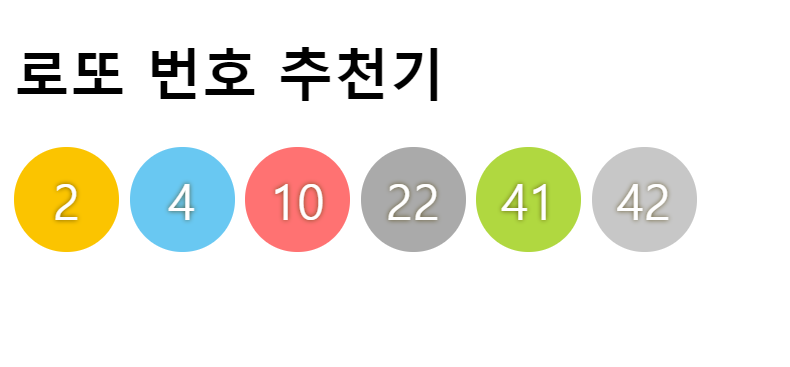
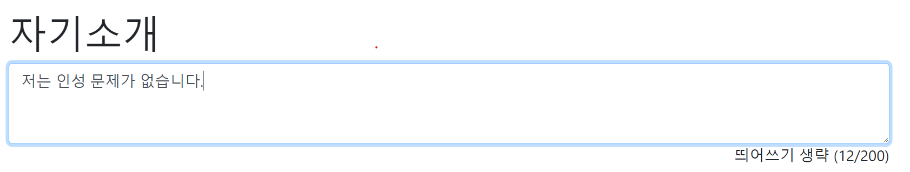
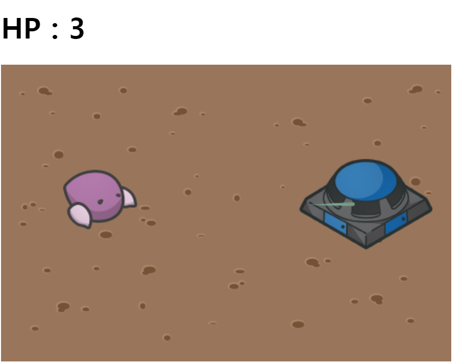
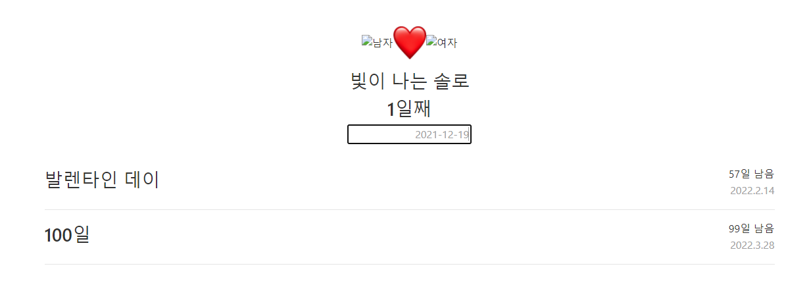

# Project_collection
## lotto-recommendation
* [코드보기](recommentation-lotto)
* [미리보기](https://jinyun3075.github.io/JS-ProjectCollection/recommendation-lotto)

## word-calculation
* [코드보기](jasoseol-cal)
* [미리보기](https://jinyun3075.github.io/JS-ProjectCollection/jasoseol-cal)

## mini-starcraft
* [코드보기](ministarcraft)
* [미리보기](https://jinyun3075.github.io/JS-ProjectCollection/ministarcraft)

## date-calculation
* [코드보기](date-cal)
* [미리보기](https://jinyun3075.github.io/JS-ProjectCollection/date-cal)

## coolJinTest
* [코드보기](coolJinTest)
* [미리보기](https://coolzz.shop/)

## MBTI-TestLayout + ad
* [코드보기](MBTI테스트)
* [미리보기](https://jinyun3075.github.io/JS-ProjectCollection/MBTI테스트)
